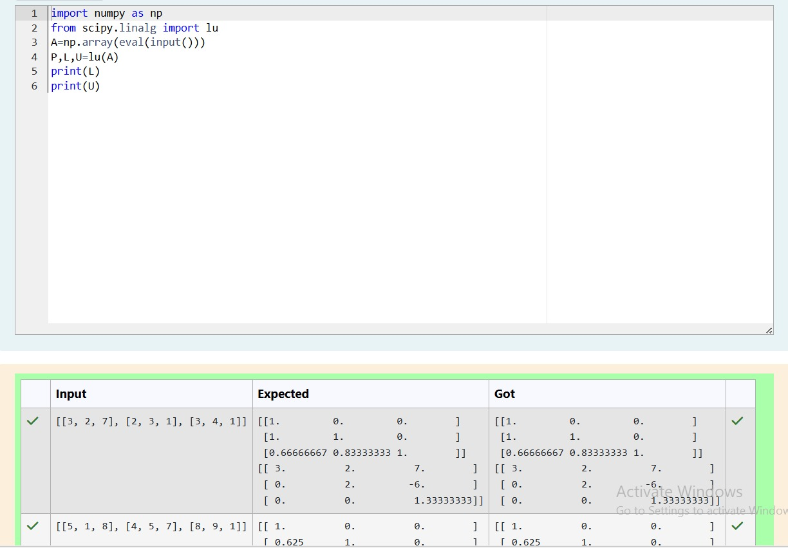
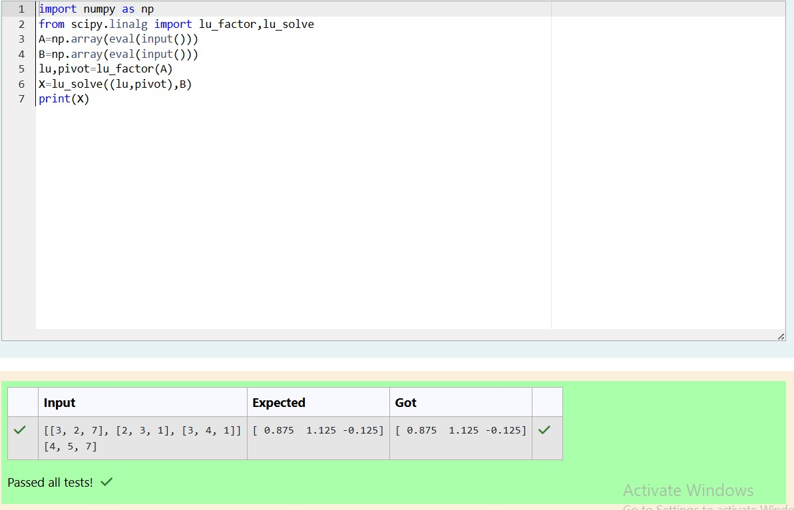

# LU Decomposition 

## AIM:
To write a program to find the LU Decomposition of a matrix.

## Equipments Required:
1. Hardware – PCs
2. Anaconda – Python 3.7 Installation / Moodle-Code Runner

## Algorithm
1. 
2. 
3. 
4. 

## Program:
(i) To find the L and U matrix
```
import numpy as np
from scipy.linalg import lu
A=np.array(eval(input()))
P,L,U=lu(A)
print(L)
print(U)
/*

```
(ii) To find the LU Decomposition of a matrix
```
/*
Program to find the LU Decomposition of a matrix.
Developed by: Monika S
RegisterNumber:212225230184
import numpy as np
from scipy.linalg import lu_factor,lu_solve
A=np.array(eval(input()))
B=np.array(eval(input()))
lu,pivot=lu_factor(A)
X=lu_solve((lu,pivot),B)
print(X)
*/
```

## Output:




## Result:
Thus the program to find the LU Decomposition of a matrix is written and verified using python programming.

